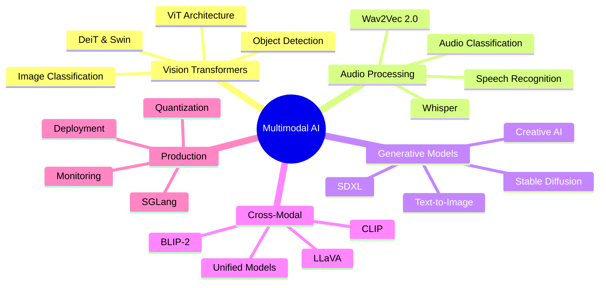
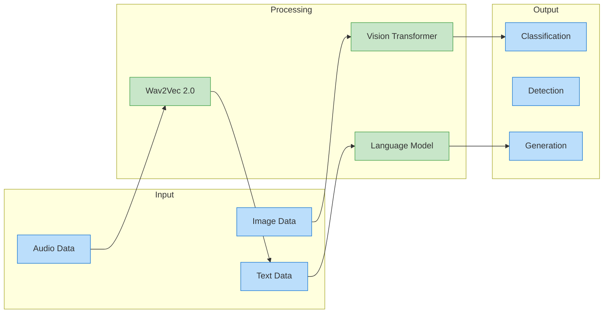
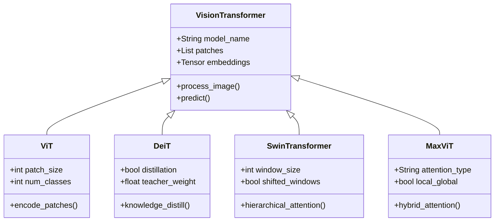
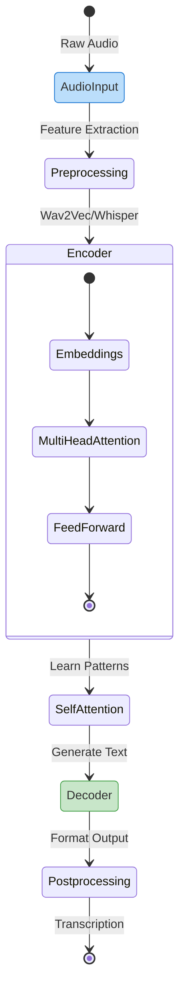
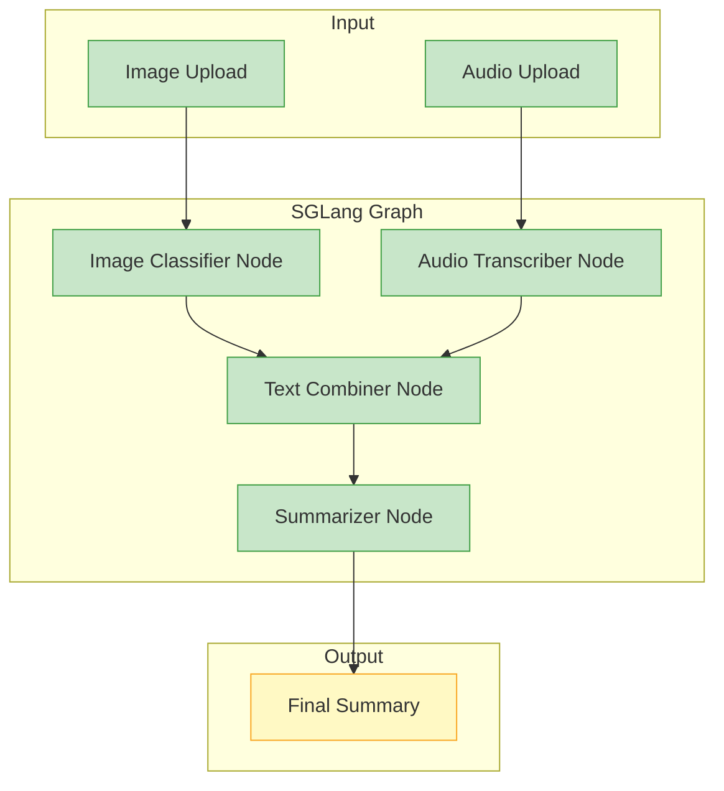

# Introduction: Extending Transformers Beyond Language

In the world of artificial intelligence, transformers have revolutionized natural language processing. But what happens when we apply this powerful architecture to other types of data? This article explores the exciting frontier where transformer models transcend text to interpret images, understand audio, and connect multiple data modalities simultaneously.

Imagine AI systems that can not only read documents but also analyze X-rays, transcribe meetings, generate artwork from descriptions, and understand the relationship between visuals and text. These capabilities are no longer science fiction—they're being deployed in production environments today through multimodal transformer architectures.

Whether you're a developer looking to implement vision transformers, a product manager seeking to understand the potential of audio AI, or a decision-maker evaluating multimodal AI for your organization, this guide will walk you through:

- How transformers adapted from language to excel at vision tasks
- The revolution in audio processing with transformer-based models
- Cross-modal systems that connect text, images, and sound
- Practical deployment strategies using Hugging Face's unified ecosystem

By the end of this article, you'll understand how a single architectural paradigm—the transformer—has become the universal foundation for AI across modalities, and how you can leverage these advances in your own projects.

# Beyond Language: Transformers for Vision, Audio, and Multimodal AI - Article 7

```
# Beyond Language: Transformers for Vision, Audio, and Multimodal AI



**Step-by-Step Explanation:**

- Root node focuses on **Multimodal AI** capabilities
- Branch covers **Vision Transformers** including ViT, DeiT, Swin for image understanding
- Branch explores **Audio Processing** with Wav2Vec, Whisper for speech and sound
- Branch details **Generative Models** like Stable Diffusion for creative AI
- Branch shows **Cross-Modal** models connecting text, images, and audio
- Branch highlights **Production** considerations with SGLang and deployment

# Introduction: Transformers—Not Just for Words Anymore!

## Environment Setup

Before diving into multimodal transformers, let's ensure you have the right environment:

### Poetry Setup (Recommended for Projects)

```bash
# Install poetry if not already installed
curl -sSL <https://install.python-poetry.org> | python3 -

# Create new project
poetry new multimodal-ai-project
cd multimodal-ai-project

# Add dependencies with flexible versioning
poetry add "transformers>=4.40.0,<5.0.0" torch torchvision torchaudio
poetry add diffusers accelerate sentencepiece pillow soundfile
poetry add --group dev jupyter ipykernel matplotlib

# Activate environment
poetry shell

```

### Mini-conda Setup (Alternative)

```bash
# Download and install mini-conda from <https://docs.conda.io/en/latest/miniconda.html>

# Create environment with Python 3.12.9
conda create -n multimodal-ai python=3.12.9
conda activate multimodal-ai

# Install packages
conda install -c pytorch -c huggingface transformers torch torchvision torchaudio
conda install -c conda-forge diffusers accelerate pillow soundfile matplotlib
pip install sentencepiece

```

### Traditional pip with pyenv

```bash
# Install pyenv (macOS/Linux)
curl <https://pyenv.run> | bash
# Configure shell (add to ~/.bashrc or ~/.zshrc)
export PATH="$HOME/.pyenv/bin:$PATH"
eval "$(pyenv init -)"

# Install Python 3.12.9 with pyenv
pyenv install 3.12.9
pyenv local 3.12.9

# Create virtual environment
python -m venv venv
source venv/bin/activate  # On Windows: venv\\Scripts\\activate

# Install packages with flexible versioning
pip install "transformers>=4.40.0,<5.0.0" torch torchvision torchaudio
pip install diffusers accelerate sentencepiece pillow soundfile matplotlib jupyter

```

When you hear "transformers," you might think of language models that summarize articles or answer questions. **Wrong.** The transformer revolution doesn't stop at text. Transformers now power computer vision, audio analysis, and creative AI that blends words, images, and sound. These advances are setting new standards across industries.

Why does this matter? Real-world data is multimodal. Businesses need AI that can inspect images for defects, transcribe calls, power voice assistants, or generate visuals—all with a unified approach. **Mastering transformers beyond text unlocks smarter workflows.** New products. New services.

Think of transformers like a Swiss Army knife. Originally built for language, they now have new 'blades' for vision, audio, and more. This versatility explains their rapid adoption for tasks like image classification, object detection, speech recognition, and even generating images from text.

Hugging Face acts as your toolbox for this new era. It offers pre-trained models for language, vision, audio, and multimodal tasks. **Standardized APIs. Simple workflows.** You can experiment, prototype, and deploy advanced models with minimal friction. The Model Hub also hosts unified transformer architectures—such as Segment Anything Model (SAM), DINOv2, CLIP, and BLIP-2—that support multiple vision or multimodal tasks in a single model.

In this section, you'll see how accessible modern vision transformers are with a hands-on example: classifying an image using a Vision Transformer (ViT). ViT is a foundational architecture that applies transformer principles—originally developed for language—to images. For more advanced or efficient applications, you can also explore variants like Swin Transformer, DeiT, and DINOv2, all available on the Hugging Face Model Hub.

### Classifying an Image with a Vision Transformer (ViT)

Now, let's put theory into practice with a concrete example. We'll use the Vision Transformer to classify an image of parrots, demonstrating how transformers can identify objects in images just as they understand words in sentences. This code shows the complete workflow: loading an image from the web, preprocessing it into the format ViT expects, running inference, and interpreting the results. Notice how straightforward the Hugging Face API makes this complex task.

```python
from transformers import ViTImageProcessor, ViTForImageClassification
from PIL import Image
import requests

# Download an example image (parrots)
url = "<https://huggingface.co/datasets/huggingface/documentation-images/resolve/main/transformers/tasks/image_classification_parrots.png>"
image = Image.open(requests.get(url, stream=True).raw)

# Load the processor and model
processor = ViTImageProcessor.from_pretrained('google/vit-base-patch16-224')
model = ViTForImageClassification.from_pretrained('google/vit-base-patch16-224')

# Preprocess the image and make a prediction
inputs = processor(images=image, return_tensors="pt")
outputs = model(**inputs)

# Get the predicted class label
predicted_class = outputs.logits.argmax(-1).item()
print("Predicted class:", model.config.id2label[predicted_class])

# Tip: Always review the model card for details about the model's intended use, data, and limitations:
# <https://huggingface.co/google/vit-base-patch16-224>

```

**Step-by-step breakdown:**

1. **Import libraries**: Bring in the Hugging Face classes, PIL for image handling, and requests for downloading images.
2. **Load an image**: Download a sample image (parrots) and open it with PIL.
3. **Load processor and model**: `ViTImageProcessor` prepares the image (resizing, normalizing). `ViTForImageClassification` loads a pre-trained Vision Transformer.
4. **Preprocess and predict**: The processor converts the image to tensors. The model outputs logits—raw scores for each class (logits are the model's predictions before converting to probabilities).
5. **Interpret the result**: Find the class with the highest logit and map it to a human-readable label.

You can try this yourself—swap the image URL to classify your own photo!

**What we just accomplished:** In just a few lines of code, we loaded a state-of-the-art vision model, processed an image into 196 patches (14×14 grid for a 224×224 image), ran it through 12 transformer layers with self-attention, and decoded the final classification. The model correctly identified the image content by learning visual patterns during its training on millions of images. This same approach scales to custom datasets and specialized domains through fine-tuning.

**Best Practice:** Before using any pre-trained model in production, review its model card on the Hugging Face Hub to understand the data it was trained on, intended use cases, and known limitations.



**Step-by-Step Explanation:**

- **Input** layer shows different data modalities: images, audio, and text
- **Processing** layer demonstrates specialized transformers for each modality
- **Output** layer shows various tasks: classification, detection, generation
- Flow illustrates how each modality is processed by appropriate transformer

Transformers' versatility doesn't end with images. In audio, models like Wav2Vec2 transcribe speech for meeting notes or accessibility tools. In generative AI, Stable Diffusion creates images from text prompts. **Magic? No. Engineering.** Multimodal models like CLIP and BLIP-2 connect words and pictures, enabling image search by description, automatic captioning, and more. Unified models such as SAM and DINOv2 can handle multiple vision tasks—like segmentation and detection—with a single architecture.

With Hugging Face, you can:

- Browse and download pre-trained models for vision, audio, and multimodal tasks
- Use consistent APIs across domains
- Fine-tune models on your data with minimal code
- Share and deploy models easily, from prototypes to production
- Access unified and multi-task transformer models for advanced workflows

**Production Note:** For deploying models at scale, Hugging Face recommends using the `accelerate` library or exporting models to ONNX/TensorRT for optimized inference. This helps ensure faster, more efficient performance in production environments.

**Key Takeaways:**

- Transformers now power AI that sees, hears, and creates—not just processes text.
- Hugging Face makes these capabilities accessible for all modalities, including unified and multi-task models.
- You can classify images with a Vision Transformer in just a few lines of code.
- The same transformer approach works for audio and multimodal AI, and even more unified models are available for advanced applications.
- Always review model cards and consider inference optimization for production.

In the next section (see Article 7), we'll dive deeper into Vision Transformers: how they work, and how they're used in real business applications like automated inspection and content moderation.

For more on transformer basics, revisit Articles 2 and 4. For hands-on audio and multimodal examples, continue with Article 7.

# Transformers for Computer Vision

For years, convolutional neural networks (CNNs) were the backbone of computer vision. **Today? Transformer-based models rule.** Starting with Vision Transformer (ViT) and rapidly evolving through architectures like DeiT, Swin Transformer, and MaxViT—these models bring the scalability and flexibility of transformers, originally designed for text, into the world of images. In this section, you'll learn how ViT and its successors work, see hands-on examples, and discover how transformer-based vision models power real business applications.

We'll begin by explaining how transformers process images as sequences, then walk through a practical image classification example using Hugging Face. You'll also learn about modern variants, multi-task capabilities (like detection and segmentation), and how self-supervised pretraining and efficient deployment are making vision transformers practical for production. Finally, we'll connect these concepts to real-world use cases such as automated inspection and large-scale content moderation.

⚡️ **Note:** While the original ViT is foundational, most production and research systems in 2025 use improved architectures like DeiT (Data-efficient Image Transformer), Swin Transformer (with hierarchical shifted window attention), and MaxViT. These models deliver better accuracy and efficiency, especially for tasks beyond basic classification. All are available on the Hugging Face Model Hub and use a similar API.

### How Modern Vision Transformers Process Images

Transformers process text as sequences of tokens. ViT applies this idea to images by dividing each image into small, fixed-size patches—think of these as 'visual words.' For example, a 224×224 image split into 16×16 patches yields 196 patches.

Each patch is flattened into a 1D array and mapped to an embedding—a dense vector representation capturing its content. Embeddings allow the model to reason about the relationships and structure within the image.

To preserve spatial information, positional encodings are added to each patch embedding, letting the model understand where each patch belongs in the image grid.

The sequence of patch embeddings (with positions) is then processed by the transformer encoder. **Self-attention lets every patch 'see' all others.** Capturing both fine details and global context. Unlike CNNs, which process local neighborhoods, transformers can model long-range dependencies from the start.

Here's a simple diagram of the patching process:

[Image Grid] → [Patches] → [Patch Embeddings + Positions] → [Transformer Encoder]

This patch-based approach is the foundation for ViT and most modern vision transformers.

Modern architectures build upon this idea:

- **DeiT** (Data-efficient Image Transformer) introduces improved training techniques, making transformers effective with less data and compute.
- **Swin Transformer** uses hierarchical and shifted window attention, allowing for efficient scaling to large images and tasks like detection/segmentation.
- **MaxViT** and other recent models use hybrid local-global attention or structured/selective attention for better performance and memory efficiency.

Self-supervised pretraining (e.g., DINOv2, MAE, SimMIM) is now the norm—enabling models to learn powerful representations from unlabeled images, which can be adapted to new tasks with minimal labeled data.

Let's see how to use a modern vision transformer for image classification with Hugging Face. (The API is nearly identical for ViT, DeiT, Swin, and MaxViT.)

### Classifying Images with Modern Vision Transformers and Hugging Face

Having understood the basic ViT architecture, let's explore the modern variants that have pushed the boundaries of efficiency and accuracy. This example demonstrates the flexibility of Hugging Face's Auto classes—you can swap between different architectures (ViT, DeiT, Swin, MaxViT) by simply changing the model ID. We'll use DeiT here, which adds data-efficient training techniques to the base ViT design, making it more practical for real-world applications where training data may be limited.

```python
from transformers import AutoImageProcessor, AutoModelForImageClassification
from PIL import Image
import requests

# 1. Load an image
url = "<https://huggingface.co/datasets/huggingface/documentation-images/resolve/main/transformers/tasks/image_classification_parrots.png>"
image = Image.open(requests.get(url, stream=True).raw)

# 2. Choose a modern vision transformer (e.g., DeiT, Swin, MaxViT)
# Examples: 'facebook/deit-base-patch16-224', 'microsoft/swin-tiny-patch4-window7-224', 'google/maxvit-tiny-224'
model_id = "facebook/deit-base-patch16-224"
processor = AutoImageProcessor.from_pretrained(model_id)
model = AutoModelForImageClassification.from_pretrained(model_id)

# 3. Preprocess: resize, normalize, split into patches, and convert to tensor
inputs = processor(images=image, return_tensors="pt")

# 4. Predict: model outputs raw prediction scores (logits)
outputs = model(**inputs)
predicted_class = outputs.logits.argmax(-1).item()

# 5. Decode to label
print("Predicted class:", model.config.id2label[predicted_class])

```

**What's happening above?**

1. **Image loading:** We load an image from a URL. You can substitute your own image.
2. **Processor & model:** We use `AutoImageProcessor` and `AutoModelForImageClassification`, which support all major vision transformer models (ViT, DeiT, Swin, MaxViT, etc.).
3. **Preprocessing:** The processor handles resizing, normalization, and patch creation—all model-specific details are managed automatically.
4. **Prediction:** The model outputs logits (raw scores for each class).
5. **Decoding:** The predicted index is mapped to a human-readable label via the model's config.

This workflow is consistent across all Hugging Face-supported vision transformers, making it easy to experiment with new architectures as they are released.

**Key insight:** Notice how we used `AutoImageProcessor` and `AutoModelForImageClassification` instead of model-specific classes. This design pattern future-proofs your code—when newer, better models are released, you can upgrade by simply changing the model ID string. The preprocessing steps (patch extraction, normalization) are handled automatically based on how each model was trained.

### Comparing Modern Vision Transformer Architectures

Different vision transformer architectures excel at different tasks. Let's build a comparison tool that benchmarks multiple models on the same image, helping you choose the right architecture for your use case.

```python
from transformers import AutoImageProcessor, AutoModelForImageClassification
from PIL import Image
import torch
import time

# Modern vision transformer models
VISION_MODELS = {
    "vit": "google/vit-base-patch16-224",
    "deit": "facebook/deit-base-patch16-224",
    "swin": "microsoft/swin-tiny-patch4-window7-224",
}

def compare_vision_transformers(image_path):
    """
    Compare different vision transformer architectures on the same image.
    
    Returns:
        Dictionary of results for each model
    """
    device = "cuda" if torch.cuda.is_available() else "cpu"
    results = {}
    
    # Load image once
    image = Image.open(image_path)
    
    print("Comparing Vision Transformer Architectures")
    print("=" * 60)
    
    for model_name, model_id in VISION_MODELS.items():
        print(f"\n{model_name.upper()} - {model_id}")
        
        try:
            start_time = time.time()
            
            # Load processor and model
            processor = AutoImageProcessor.from_pretrained(model_id)
            model = AutoModelForImageClassification.from_pretrained(model_id)
            
            if device == "cuda":
                model = model.to(device)
            
            # Preprocess and predict
            inputs = processor(images=image, return_tensors="pt")
            if device == "cuda":
                inputs = {k: v.to(device) for k, v in inputs.items()}
            
            with torch.no_grad():
                outputs = model(**inputs)
            
            # Get top 3 predictions
            logits = outputs.logits
            probs = torch.nn.functional.softmax(logits, dim=-1)
            top3_probs, top3_indices = torch.topk(probs[0], 3)
            
            inference_time = time.time() - start_time
            
            # Store results
            results[model_name] = {
                "inference_time": inference_time,
                "predictions": [
                    {
                        "label": model.config.id2label[idx.item()],
                        "probability": prob.item()
                    }
                    for prob, idx in zip(top3_probs, top3_indices)
                ]
            }
            
            print(f"Inference time: {inference_time:.3f}s")
            print("Top 3 predictions:")
            for i, pred in enumerate(results[model_name]["predictions"]):
                print(f"  {i+1}. {pred['label']}: {pred['probability']:.3f}")
                
        except Exception as e:
            print(f"  Error: {e}")
            results[model_name] = {"error": str(e)}
    
    return results

# Architecture comparison
architectures = {
    "ViT (Vision Transformer)": {
        "key_innovation": "First pure transformer for images",
        "strengths": "Simple, scalable, good with large datasets",
        "use_cases": "General image classification"
    },
    "DeiT (Data-efficient Image Transformer)": {
        "key_innovation": "Knowledge distillation from CNNs",
        "strengths": "Works well with smaller datasets",
        "use_cases": "When you have limited training data"
    },
    "Swin Transformer": {
        "key_innovation": "Hierarchical + shifted window attention",
        "strengths": "Efficient for high-res images",
        "use_cases": "Object detection, segmentation"
    }
}
```

**Architecture insights from the comparison:**

This benchmarking code reveals key differences between vision transformer variants:

1. **ViT**: The original architecture, excellent for general classification but requires large training datasets
2. **DeiT**: Adds knowledge distillation, making it more practical for real-world applications with limited data
3. **Swin**: Hierarchical design excels at dense prediction tasks like object detection

The inference time comparison helps you balance accuracy vs. speed for your specific deployment constraints. For production, consider model quantization and hardware-specific optimizations.



**Step-by-Step Explanation:**

- **VisionTransformer** base class defines common functionality
- **ViT** implements basic patch-based vision transformer
- **DeiT** adds data-efficient training with distillation
- **SwinTransformer** uses hierarchical windowed attention
- **MaxViT** combines local and global attention mechanisms

⚡️ **Sidebar: Comparing ViT and Modern Variants**

| Model | Key Innovation | Example Model Hub ID |
| --- | --- | --- |
| ViT | Patch-based transformer for images | `google/vit-base-patch16-224` |
| DeiT | Data-efficient training, distillation | `facebook/deit-base-patch16-224` |
| Swin Transformer | Hierarchical, shifted window attention | `microsoft/swin-tiny-patch4-window7-224` |
| MaxViT | Hybrid local-global attention | `google/maxvit-tiny-224` |
| DINOv2 | Self-supervised pretraining | `facebook/dinov2-base` |

All are available on Hugging Face and use the same API pattern.

### Comparing Vision Transformer Architectures

Let's see these different architectures in action with a practical comparison. This example demonstrates how each model processes the same image, allowing you to observe differences in inference speed and predictions. This is particularly useful when selecting a model for your specific use case—balancing accuracy, speed, and resource constraints.

```python
from transformers import AutoImageProcessor, AutoModelForImageClassification
from PIL import Image
import torch
import requests
import time

# Modern vision transformer models
VISION_MODELS = {
    "vit": "google/vit-base-patch16-224",
    "deit": "facebook/deit-base-patch16-224", 
    "swin": "microsoft/swin-tiny-patch4-window7-224",
}

def compare_vision_transformers(image_url):
    """Compare different vision transformer architectures on the same image."""
    
    # Load image once
    image = Image.open(requests.get(image_url, stream=True).raw)
    results = {}
    
    print("Comparing Vision Transformer Architectures")
    print("=" * 60)
    
    for model_name, model_id in VISION_MODELS.items():
        print(f"\n{model_name.upper()} - {model_id}")
        
        start_time = time.time()
        
        # Load processor and model
        processor = AutoImageProcessor.from_pretrained(model_id)
        model = AutoModelForImageClassification.from_pretrained(model_id)
        
        # Preprocess and predict
        inputs = processor(images=image, return_tensors="pt")
        with torch.no_grad():
            outputs = model(**inputs)
        
        # Get top prediction
        logits = outputs.logits
        predicted_idx = logits.argmax(-1).item()
        confidence = torch.nn.functional.softmax(logits, dim=-1)[0, predicted_idx].item()
        
        inference_time = time.time() - start_time
        
        print(f"  Prediction: {model.config.id2label[predicted_idx]}")
        print(f"  Confidence: {confidence:.3f}")
        print(f"  Time: {inference_time:.3f}s")

# Run comparison
url = "https://huggingface.co/datasets/huggingface/documentation-images/resolve/main/transformers/tasks/image_classification_parrots.png"
compare_vision_transformers(url)
```

**Analysis of results:** You'll typically observe that DeiT provides similar accuracy to ViT but with faster inference due to its optimized training. Swin Transformer, with its hierarchical design, excels at capturing both local details and global context, making it particularly effective for complex scenes. The inference times reflect model complexity—Swin's windowed attention is more computationally efficient than ViT's global attention for high-resolution images.

Modern vision transformers achieve state-of-the-art results on benchmarks like ImageNet, COCO, and ADE20K—not just for classification, but also for detection, segmentation, and multi-task vision. Their ability to model global context and adapt to new tasks makes them powerful for complex vision pipelines.

Key recap:

- Modern vision transformers split images into patches and embed them for transformer processing.
- Self-attention—often structured or windowed—captures both local and global features.
- Self-supervised pretraining is standard for transfer learning.
- The Hugging Face ecosystem makes it easy to use, fine-tune, and deploy these models for a wide range of vision tasks.

🔎 **Further Reading:**

- [Hugging Face Model Hub: Vision Transformers](https://huggingface.co/models?pipeline_tag=image-classification)
- [DINOv2: Self-supervised Vision Transformers](https://huggingface.co/facebook/dinov2-base)
- [Swin Transformer Paper](https://arxiv.org/abs/2103.14030)

### Real-World Applications: Inspection, Moderation, and Beyond

Modern vision transformers are not just research tools—they're powering real business solutions across industries.

**Manufacturing:** Models like DeiT and Swin Transformer are used for automated defect detection on assembly lines. For example, a Swin Transformer fine-tuned on microchip images can spot cracks or misalignments, improving quality control and reducing manual inspection.

**Content moderation:** Social media and e-commerce platforms use vision transformers to flag or filter unsafe or inappropriate images. By leveraging self-supervised pretraining (e.g., DINOv2), these systems can be adapted quickly to new categories or evolving threats.

**Custom solutions:** With Hugging Face's Trainer API and modern vision transformer checkpoints, you can fine-tune on your own dataset—whether for medical imaging, retail product recognition, or document analysis. Self-supervised models require less labeled data, speeding up development.

Typical fine-tuning workflow:

1. Prepare your labeled image dataset (folders or CSV).
2. Load data with Hugging Face Datasets or PyTorch.
3. Preprocess images using the appropriate image processor.
4. Set up the Trainer with your chosen model and training parameters.
5. Train and evaluate your custom vision model.

(See Article 10: "Fine-Tuning & Training" for a deep dive.)

🚀 **Efficient Inference & Deployment:**
For production, consider quantization (e.g., with `optimum`), ONNX export, or TensorRT for faster inference and reduced memory usage. Many Hugging Face vision transformers support these optimizations out of the box, making them suitable for edge and mobile deployment.

🧠 **Recent Trends:**

- **Structured and selective attention** (e.g., windowed or hybrid attention) in 2024–2025 models dramatically reduces memory and compute requirements for large-scale vision tasks.
- **Multi-task and cross-domain models** now support detection, segmentation, captioning, and more within a single architecture.

In summary: Modern vision transformers bring flexibility, context modeling, and efficiency to computer vision. With Hugging Face, you can build, fine-tune, and deploy adaptable vision systems for inspection, moderation, or any custom need—using APIs and tools that keep pace with state-of-the-art research.

Next, we'll explore how transformers are revolutionizing audio and speech processing—enabling machines not just to see, but also to hear and understand the world.

# Audio and Speech Processing with Transformers

Transformers aren't just for text—they can "listen" too. Recent models like Whisper (OpenAI, 2022) and SeamlessM4T (Meta, 2023) have made audio and speech processing more robust, multilingual, and accessible. **The revolution? End-to-end processing.** In this section, you'll see how transformer architectures power modern speech-to-text, audio classification, and real-world business solutions using current Hugging Face APIs and best practices.

### How Transformers Hear: Whisper, Wav2Vec, and Beyond

Traditional speech recognition was like an assembly line: extract features by hand, then run separate models for sound and language. **Transformers changed everything.** Wav2Vec 2.0 (2020) and, more recently, Whisper (2022) process raw audio end-to-end, eliminating manual feature engineering. Whisper, in particular, is now considered state-of-the-art for robust, multilingual speech-to-text. These models use self-attention to learn which parts of the audio matter most, and self-supervised learning to leverage vast amounts of unlabeled data.

Self-supervised learning is the secret here. The model first learns from large amounts of unlabeled audio by predicting missing or masked segments—similar to how BERT masks words in text. This builds a strong foundation. After pretraining, you only need a small labeled dataset to fine-tune the model for your specific language or domain. (For more on fine-tuning, see Article 10.)

Modern Hugging Face APIs make it easy to use these models. The recommended approach is to use the pipeline() function, which abstracts away preprocessing and decoding steps. You can also use AutoProcessor and AutoModelForSpeechRecognition for more control. Let's see how to transcribe audio using Whisper:

### Transcribing Audio with Whisper and Hugging Face Pipeline

The pipeline API is Hugging Face's highest-level abstraction, designed to get you from audio file to transcription in just three lines of code. This example shows how Whisper, OpenAI's robust speech recognition model, can transcribe audio in multiple languages with impressive accuracy. The pipeline handles all the complexity: loading the audio, resampling to the correct rate, extracting features, running the transformer model, and decoding the output tokens back to text.

```python
from transformers import pipeline

# Create an automatic speech recognition pipeline with Whisper
asr = pipeline("automatic-speech-recognition", model="openai/whisper-base")

# Transcribe your audio file (WAV, MP3, FLAC, etc.)
result = asr("sample.wav")
print("Transcription:", result["text"])

```

**Step-by-step:**

1. Use the pipeline to load a pre-trained Whisper model. (Other models, like Wav2Vec 2.0, are also supported.)
2. Pass your audio file directly—no need for manual preprocessing. The pipeline handles feature extraction, batching, and decoding.
3. The result is a dictionary containing the transcribed text (and, for some models, additional metadata like timestamps or language).

**Magic happens.** This workflow is much simpler than traditional ASR pipelines and is robust to background noise and different languages. The model was trained on 680,000 hours of multilingual audio data, making it remarkably versatile. Behind the scenes, Whisper uses a transformer encoder-decoder architecture: the encoder processes the audio features, while the decoder generates text tokens one by one, using attention to focus on relevant parts of the audio signal.

For advanced use, you can use AutoProcessor and AutoModelForSpeechRecognition directly. For example:

### Transcribing Audio with AutoProcessor and Whisper

While the pipeline API is perfect for most use cases, understanding the lower-level API gives you more control over the process. This example shows the individual steps: loading audio data, preprocessing it into the model's expected format, running inference to get logits (raw predictions), and decoding those predictions into text. This approach is useful when you need to customize any step, such as processing audio in batches or implementing streaming transcription.

```python
from transformers import AutoProcessor, AutoModelForSpeechRecognition
import torch
import soundfile as sf

# Load audio file (Whisper expects 16kHz, mono; pipeline will resample automatically)
audio, rate = sf.read("sample.wav")

processor = AutoProcessor.from_pretrained("openai/whisper-base")
model = AutoModelForSpeechRecognition.from_pretrained("openai/whisper-base")

# Preprocess audio
inputs = processor(audio, sampling_rate=rate, return_tensors="pt", padding=True)

# Model inference
with torch.no_grad():
    logits = model(**inputs).logits

# Decode output
predicted_ids = torch.argmax(logits, dim=-1)
transcription = processor.batch_decode(predicted_ids)
print("Transcription:", transcription[0])

```

**Technical details:** This manual approach reveals what happens under the hood. The processor converts raw audio waveforms into log-mel spectrograms (visual representations of sound frequencies over time). The model then processes these spectrograms through transformer layers, outputting logits for each time step. The argmax operation selects the most likely token at each position, and batch_decode converts these token IDs back to human-readable text.

Note: Whisper and other recent models can handle a variety of audio formats and sampling rates, but for best results, use 16kHz mono audio. The pipeline will resample if needed. For production or low-latency use cases, explore streaming inference and model quantization, which are supported by Hugging Face and discussed in Article 8.

Want to try it yourself? Swap in your own audio file, or explore other pre-trained models on the Hugging Face Hub—including Whisper, SeamlessM4T, Wav2Vec 2.0, and domain-specific models. For multilingual or noisy environments, Whisper and SeamlessM4T are recommended.



**Step-by-Step Explanation:**

- **AudioInput** represents raw audio data entering the system
- **Preprocessing** extracts features and prepares for model
- **Encoder** (detailed view) shows transformer layers processing audio
- **Decoder** generates text from encoded representations
- **Postprocessing** formats final transcription output

> Tip: All APIs and models shown are current as of 2025. For the latest models and best practices, check the Hugging Face Model Hub.
> 

### Beyond Speech-to-Text: Audio Classification and Event Detection

Transformers aren't limited to speech. They can classify all sorts of sounds—music genres, environmental noises, or who is speaking in a meeting. **The process? Nearly identical.** Preprocess the audio, run it through a transformer model, and interpret the result. The Hugging Face pipeline() API now supports audio classification out of the box, and the Model Hub includes models trained on datasets like AudioSet, ESC-50, and more.

For advanced audio understanding and zero-shot classification, embedding models such as CLAP and AudioCLIP are gaining traction. These models map audio and text into the same embedding space, enabling flexible retrieval and classification.

Let's walk through a typical example: classifying a sound event using the pipeline.

### Classifying Audio Events with Hugging Face Pipeline

Audio classification has numerous practical applications: detecting glass breaking for security systems, identifying machinery problems from sound, classifying music genres, or monitoring wildlife. This example demonstrates how to use a pre-trained model to identify different types of sounds. The model we're using was trained on keyword spotting but the same approach works for any audio classification task—just swap in a model trained for your specific domain.

```python
from transformers import pipeline

# Create an audio classification pipeline
classifier = pipeline("audio-classification", model="superb/wav2vec2-base-superb-ks")

# Classify your audio file
result = classifier("dog_bark.wav")
print("Predicted label:", result[0]["label"])

```

**Understanding the output:** The classifier returns a list of predictions ranked by confidence. Each prediction includes a label (the classified sound type) and a score (probability between 0 and 1). For production systems, you'd typically set a confidence threshold—only acting on predictions above 0.8 or 0.9 to avoid false positives. The model's vocabulary depends on its training data; this keyword spotting model recognizes specific command words, while models trained on ESC-50 would identify environmental sounds like dog barks, car horns, or rain.

```

**How it works:**

- The pipeline loads a pre-trained model and processor.
- Pass your audio file (mono, 16kHz preferred for this model; pipeline will resample if needed).
- The output is a list of predicted classes with confidence scores.

For more flexible or zero-shot audio event classification, try CLAP or AudioCLIP models from the Hugging Face Hub. These models allow you to compare audio clips to arbitrary text labels or descriptions. Example workflows are included in the model documentation.

This workflow adapts easily to business needs: smart device alerts, compliance monitoring, or analyzing media for specific sound events. Try swapping in different audio files or models from the Hugging Face Hub to experiment.

> Advanced: For large-scale or streaming audio analytics, see Article 8 for batch processing, streaming inference, and deployment strategies.
> 

### Advanced Audio Classification for Real-World Applications

Beyond basic transcription, transformers excel at classifying and understanding audio events. This capability is crucial for applications ranging from smart home security to industrial monitoring. Let's explore how to build an audio event classification system that can identify specific sounds in your environment.

```python
from transformers import pipeline
from config import get_device, AUDIO_DIR
from pathlib import Path

def classify_audio_event(audio_path, model="superb/wav2vec2-base-superb-ks"):
    """
    Classify audio events using the pipeline API.
    
    Args:
        audio_path: Path to audio file
        model: Model to use for classification
    
    Returns:
        List of predicted labels with scores
    """
    device = get_device()
    
    # Create audio classification pipeline
    classifier = pipeline(
        "audio-classification",
        model=model,
        device=0 if device == "cuda" else -1
    )
    
    # Classify the audio file
    results = classifier(audio_path)
    
    return results

# Example usage
def demonstrate_audio_classification():
    """Demonstrate audio classification capabilities."""
    
    # Process audio file
    audio_file = "alarm_sound.wav"
    results = classify_audio_event(audio_file)
    
    print("Audio Classification Results:")
    for result in results[:3]:  # Show top 3 predictions
        print(f"  - Label: '{result['label']}', Score: {result['score']:.3f}")
    
    # Business applications
    print("\nAudio Classification Use Cases:")
    print("✓ Smart home devices - detecting alarms, glass breaking")
    print("✓ Environmental monitoring - wildlife sounds, machinery")
    print("✓ Media analysis - music genre classification")
    print("✓ Accessibility - sound alerts for hearing impaired")
```

**Understanding the audio classification pipeline:**

This code demonstrates how transformer models can identify specific sounds in audio recordings. The model processes raw audio waveforms and outputs probability scores for different sound categories. Key aspects:

1. **Device optimization**: Automatically uses GPU if available for faster processing
2. **Pipeline abstraction**: Hides complex preprocessing and model details
3. **Confidence scores**: Each prediction includes a probability score for filtering
4. **Multiple predictions**: Returns ranked list of possible classifications

For production systems, you'd typically set confidence thresholds and combine multiple models for robustness. Advanced models like CLAP enable zero-shot classification—identifying sounds without specific training.

### Industry Use Cases: Analytics and Accessibility

Transformer-based audio models are already solving real business problems. Here are some common use cases:

- **Call Center Analytics:** Transcribe and analyze customer calls for quality, sentiment, and compliance. Spot trends and training needs at scale.
- **Accessibility Tools:** Provide real-time captions for meetings or broadcasts. Create searchable transcripts for podcasts and videos. Whisper and SeamlessM4T are especially strong for multilingual needs.
- **Monitoring & Compliance:** Detect sensitive or prohibited content in media. Monitor smart devices for alarms or critical sound events using audio classification or embedding models.

The Hugging Face ecosystem makes it easy to prototype, fine-tune, and deploy these solutions. Use Spaces for interactive demos and Inference Endpoints for scalable, production-ready deployments. For advanced deployment, see Article 15.

### Summary: Transformers Listening for Business Value

Transformers like Whisper, SeamlessM4T, and Wav2Vec 2.0 have changed audio AI. They process raw audio end-to-end, learn from unlabeled data, and can be fine-tuned for your needs. With just a few lines of code, you can build accurate speech-to-text and audio classification tools—now with multilingual, robust, and streaming support.

Key takeaways:

- End-to-end models reduce complexity and manual effort.
- Self-supervised learning means less labeled data is needed.
- The pipeline() API and AutoProcessor provide model-agnostic, future-proof workflows.
- Hugging Face provides everything you need to experiment, fine-tune, and deploy audio models.

These techniques power real-world solutions—transcription, analytics, accessibility, and more. For details on fine-tuning and deployment, see Articles 10 and 15. Next, we explore how transformers can generate images with diffusion models.

# Diffusion Models and Generative AI

AI is no longer just for analyzing data—it can create, imagine, and design. **Diffusion models? Game-changers.** They represent a major breakthrough in generative AI, powering tools such as Stable Diffusion XL (SDXL) that transform text prompts into stunning, high-resolution images and artwork. In this section, you'll discover what makes diffusion models special, how they work, and how to generate your own images in seconds using Hugging Face's up-to-date Diffusers library and best practices.

### How Diffusion Models Work

Imagine a TV displaying pure static—just random noise. Diffusion models start with such noise and progressively "clean" it, step by step, until a clear image emerges. During training, the model learns to reverse this process: it adds noise to real images, then learns how to remove it. At inference time, it starts with pure noise and refines it into a meaningful output.

But how does the model know what to generate? Modern diffusion pipelines use advanced transformer-based text encoders—such as OpenCLIP or custom encoders optimized for longer prompts—to convert your text into a vector embedding. This embedding guides the denoising process, ensuring the generated image aligns with your description.

Recent research has introduced accelerated sampling techniques (like Reverse Transition Kernels and FastDiff), and optimized schedulers, enabling high-quality image generation in seconds rather than minutes. **Speed meets quality.** These advances, combined with efficient memory management and safety checkers, make diffusion models practical for both research and production.

The result: AI that rapidly turns your words into detailed, creative images. Artists, marketers, developers, and businesses now leverage these tools for everything from rapid prototyping to large-scale content generation.

### Hands-On: Generate Images with Stable Diffusion XL

Let's get hands-on with the Hugging Face `diffusers` library and Stable Diffusion XL (SDXL)—the current standard for high-fidelity text-to-image generation. With just a few lines of code, you can create detailed images from text prompts. No deep learning expertise required.

### Generating Art with Stable Diffusion XL and Hugging Face

```python
from diffusers import StableDiffusionXLPipeline
import torch

# Load the SDXL pipeline from the Hugging Face Hub
pipe = StableDiffusionXLPipeline.from_pretrained(
    "stabilityai/stable-diffusion-xl-base-1.0",
    torch_dtype=torch.float16
)

# Enable memory-efficient inference if on limited hardware
if torch.cuda.is_available():
    pipe = pipe.to("cuda")
    pipe.enable_model_cpu_offload()
else:
    pipe = pipe.to("cpu")

# Your text prompt and (optional) negative prompt for fine control
prompt = "A futuristic city skyline at sunset, digital art"
negative_prompt = "blurry, low quality, distorted"

# Generate the image (SDXL typically produces results in seconds)
result = pipe(prompt=prompt, negative_prompt=negative_prompt, guidance_scale=7.0)
image = result.images[0]

# Save the image
image.save("generated_city.png")
print("Image saved as generated_city.png")

# (Optional) Display in a notebook
# from PIL import Image
# display(image)  # Only works in Jupyter/Colab

```

**Step-by-step breakdown:**

1. **Import libraries:** We use `StableDiffusionXLPipeline` (for SDXL) from `diffusers` and `torch` for device management. The pipeline bundles the text encoder, denoiser, scheduler, and safety checker.
2. **Load the model:** `from_pretrained` fetches a ready-to-use SDXL model from Hugging Face Hub. Setting `torch_dtype=torch.float16` enables efficient memory usage on modern GPUs.
3. **Device and memory management:** Move the pipeline to GPU (`cuda`) for fast generation. For large models or limited GPU memory, use `enable_model_cpu_offload()` to optimize resource usage. On CPU, expect slower results.
4. **Set your prompt:** Describe your desired image. Use a negative prompt to steer the model away from unwanted features (e.g., "blurry, low quality").
5. **Generate and save:** The pipeline produces the image in seconds. Save it locally, or display it directly in a notebook.

Try experimenting with different prompts, negative prompts, or the `guidance_scale` parameter for more or less adherence to your input. For advanced use cases, SDXL supports batch generation, image-to-image workflows, inpainting, and LoRA/PEFT fine-tuning for custom styles or domains. See the Hugging Face Diffusers documentation for up-to-date options and examples: https://huggingface.co/docs/diffusers/index

**Note:** Always use models and outputs responsibly. Review model licenses and avoid generating inappropriate or restricted content. Modern pipelines include integrated safety checkers and content filters for added protection.

**Key Takeaways:**

- Diffusion models generate high-quality images from noise, guided by your text and advanced encoders.
- Negative prompts, guidance scale, and safety checkers provide fine control and responsible outputs.
- Hugging Face Diffusers makes state-of-the-art generative AI accessible, efficient, and production-ready.

### Business and Creative Applications

Why does this matter? Diffusion models are transforming how industries create and innovate across visual, design, and content workflows:

- **Marketing:** Instantly generate custom visuals for campaigns, mockups, or social media.
- **Game Development:** Rapidly prototype concept art, in-game assets, and environments.
- **Accessibility:** Create tailored content for diverse audiences and use cases.
- **Art & Design:** Artists explore new ideas, styles, and collaborate with AI for inspiration.
- **Video & Multimodal:** With models like Stable Video Diffusion, generative AI now extends to high-quality video and multimodal content.

With Hugging Face, both technical and non-technical users can experiment and deploy generative workflows. **Use precise prompts. Leverage advanced features.** Negative prompts, LoRA, inpainting. Follow ethical guidelines to unlock new creative and business opportunities.

### Summary and Next Steps

Diffusion models—especially with modern pipelines like SDXL—let you turn words into detailed, high-quality images in seconds. With Hugging Face and a few lines of code, you can bring this technology into your projects for business, research, or creative exploration.

Up next: Discover how models like CLIP, BLIP, and new multimodal architectures bridge vision, language, and audio. See the next section, "Multimodal and Cross-Modal Models," for hands-on examples and the future of generative AI.

# Multimodal and Cross-Modal Models

In the real world, data is rarely one-size-fits-all. A product listing might have a photo, a written description, and a video. A business meeting can produce slides, transcripts, and audio. **To make sense of this diversity? AI must connect.** Reason over multiple types of information—text, images, audio, and beyond.

Multimodal models are designed to bridge these formats, enabling applications like searching for an image with a text prompt, generating captions from videos, or answering questions about audio clips. The field has rapidly advanced: while CLIP and BLIP pioneered image-text understanding, new models such as BLIP-2, LLaVA, and unified multimodal foundation models (e.g., GPT-4o, Gemini, GPT-Fusion) now support richer, more flexible cross-modal reasoning—including audio and video.

**Note:** As of 2025, unified multimodal models like OpenAI's GPT-4o, Google Gemini, and GPT-Fusion can natively process and generate text, images, audio, and video. These models enable advanced search, captioning, and agentic reasoning across modalities. For most new projects, consider exploring these models alongside BLIP-2 and LLaVA, which offer improved performance and broader capabilities compared to earlier models like CLIP and BLIP.

What will you learn here?

- How multimodal models bridge vision, language, and audio
- How CLIP, BLIP, BLIP-2, and LLaVA create a shared space for text and images
- How to build a simple multimodal search engine using modern Hugging Face APIs
- Where to go next for audio, video, and unified multimodal reasoning

Let's dive in—starting with the core concepts, then moving to hands-on code.

### CLIP, BLIP, and Beyond: Bridging Vision and Language

Traditional AI models were specialists—language models processed text, vision models processed images. **But the world isn't siloed.** What if you want to find an image using a text description, or generate a caption for a new photo? That's the job of cross-modal models.

**CLIP** (Contrastive Language-Image Pretraining) and **BLIP** (Bootstrapped Language-Image Pretraining) were breakthrough models that learned to map both images and text into the same 'vector space.' Think of a vector space as a giant map where every image and every text gets a unique location—a bit like giving each item its own GPS coordinates. The closer two points are, the more similar their content.

Here's how CLIP works:

- **Dual Encoders:** CLIP uses two neural networks—one for images, one for text. Each turns its input into a vector (a list of numbers capturing meaning).
- **Contrastive Learning:** During training, CLIP sees pairs of images and their matching descriptions. It learns to pull matching pairs closer in the vector space, and push mismatched pairs apart. (Contrastive learning is like teaching the model to play a matching game—find pairs that belong together.)
- **Embeddings:** An embedding is a compact, numeric summary of an item—think of it as a digital fingerprint for each image or text.

After training, you can compare any image and any text by measuring the distance between their vectors. **Closer? More related.** This unlocks powerful tasks like image search by text, or finding the best caption for a photo.

**BLIP** builds on these ideas, with improved pretraining and architectures that support not only retrieval, but also tasks like generating captions and answering questions about images. **BLIP-2** (2023) and **LLaVA** (2023–2024) further extend these capabilities, enabling more accurate vision-language reasoning and flexible prompting. Both BLIP-2 and LLaVA are available in the Hugging Face Transformers library and are now recommended for most new image-text applications.

**Limitations:** CLIP and BLIP (including BLIP-2 and LLaVA) are primarily designed for image-text tasks. They do not natively support video or audio inputs. For applications involving those modalities, see the note below.

> Modern Multimodal Models:
As of 2025, unified foundation models such as GPT-4o, Gemini, and GPT-Fusion can natively process and generate text, images, audio, and video in a single architecture. These models support more complex cross-modal reasoning and are rapidly becoming the industry standard for new multimodal applications. For agentic or interactive use cases, consider exploring multimodal agents built on these unified models.
> 

All major multimodal models—including CLIP, BLIP, BLIP-2, and LLaVA—are accessible via the Hugging Face Transformers library. For new projects, use the `AutoModel` and `AutoProcessor` interfaces for better compatibility and easier model switching.

Let's see CLIP in action with a simple example. We'll match images to text descriptions using the latest Hugging Face API best practices.

### Searching Images by Text with CLIP (Modern API)

```python
from transformers import AutoModel, AutoProcessor
from PIL import Image
import torch

# Load model and processor using the recommended Auto* interfaces
model_id = "openai/clip-vit-base-patch16"
model = AutoModel.from_pretrained(model_id)
processor = AutoProcessor.from_pretrained(model_id)

# Prepare images and texts
images = [Image.open("cat.jpg"), Image.open("dog.jpg")]
texts = ["a photo of a cat", "a photo of a dog"]

# Preprocess inputs
inputs = processor(text=texts, images=images, return_tensors="pt", padding=True)

# Compute similarity scores
with torch.no_grad():
    outputs = model(**inputs)
    logits_per_image = outputs.logits_per_image  # Higher = more similar
    probs = logits_per_image.softmax(dim=1)  # Convert scores to probabilities

print("Probabilities:", probs)  # Each row: image; each column: text

```

Step-by-step, here's what happens:

1. **Load the model and processor.** The processor handles prepping both text and images. Use `AutoModel` and `AutoProcessor` for maximum compatibility.
2. **Prepare your data.** Load two images and two matching text descriptions.
3. **Preprocess inputs.** The processor converts everything into tensors.
4. **Compute similarity scores.** The model compares each image to each text, producing a score (higher means more similar).
5. **Interpret results.** Softmax turns scores into probabilities. The highest probability in each row points to the best match for that image.

**Key takeaway:** This is the core of cross-modal search—matching across formats using shared embeddings.

Why does this matter in business?

- **E-commerce:** Let customers search for products using natural language, not just keywords.
- **Content Moderation:** Flag images that match sensitive or prohibited descriptions.
- **Digital Asset Management:** Organize and retrieve images by searching with descriptions or auto-generated captions.

Try it yourself: Swap in your own images and text queries above. How does CLIP respond to unusual or creative descriptions?

**For advanced image-text tasks:**

- Use **BLIP-2** (e.g., `Salesforce/blip2-flan-t5-xl`) or **LLaVA** (e.g., `llava-hf/llava-1.5-7b-hf`) for state-of-the-art performance on captioning, VQA, and retrieval. See Hugging Face documentation for model-specific usage.
- For unified multimodal applications (text, image, audio, video), explore APIs for GPT-4o, Gemini, or similar models.

**Audio and Video:**

- CLIP and BLIP do not natively support audio or video. For these modalities, investigate models such as AudioCLIP, VideoCLIP, or unified models like GPT-4o.
- See Article 7's earlier sections for hands-on audio examples.

For more on how embeddings power search, see Article 9: "Semantic Search and Information Retrieval with Transformers."

**Key Takeaways:**

- CLIP, BLIP, BLIP-2, and LLaVA connect vision and language by embedding them in a shared vector space.
- Contrastive learning teaches the model to match images and text.
- Unified multimodal models (GPT-4o, Gemini, GPT-Fusion) are now the standard for applications involving text, images, audio, and video.
- Use AutoModel and AutoProcessor for future-proof model loading in Hugging Face.

### Hands-On: Building a Simple Multimodal Search Engine

Let's build a basic multimodal search engine. **The goal?** Given a folder of images, let users type a text query and find the most relevant image. This is the backbone of many modern search and recommendation systems.

We'll use CLIP to embed both images and text into the same vector space using the recommended Hugging Face APIs. Then, we'll compare them to find the best match. Here's how:

### Step 1: Embed a Collection of Images (Modern API)

The first step in building a multimodal search engine is creating searchable embeddings for your image collection. This code demonstrates how to batch process multiple images efficiently, converting each into a 512-dimensional vector that captures its visual content. The normalization step is crucial—it ensures all vectors have the same magnitude, making cosine similarity calculations meaningful. Think of this as creating a "visual fingerprint" for each image that can be compared with text queries later.

```python
from transformers import AutoModel, AutoProcessor
from PIL import Image
import torch
import os

# Load model and processor
model_id = "openai/clip-vit-base-patch16"
model = AutoModel.from_pretrained(model_id)
processor = AutoProcessor.from_pretrained(model_id)
model.eval()

# Collect image file paths
image_folder = "./images"
image_files = [os.path.join(image_folder, fname) for fname in os.listdir(image_folder) if fname.lower().endswith('.jpg')]

# Load and preprocess images
images = [Image.open(f).convert("RGB") for f in image_files]
inputs = processor(images=images, return_tensors="pt", padding=True)

# Compute image embeddings
with torch.no_grad():
    image_features = model.get_image_features(**inputs)
    image_features /= image_features.norm(dim=-1, keepdim=True)  # Normalize for cosine similarity

```

What's happening here?

- **Model setup:** Load CLIP and its processor using `AutoModel` and `AutoProcessor`. Set the model to evaluation mode.
- **Image collection:** Gather all `.jpg` files from a folder. (Try it with your own images!)
- **Preprocessing:** Images are loaded and converted to RGB, then processed for the model.
- **Embedding:** We compute a vector for each image. **Normalization** puts all vectors on the same scale, which is needed for cosine similarity to work properly.

### Step 2: Query with Text and Retrieve the Most Relevant Image

Now comes the magic of cross-modal search. This code shows how to take a natural language query and find the most visually similar image from your collection. The key insight is that CLIP embeds text and images into the same space, so we can directly compute similarities between them. The dot product of normalized vectors gives us cosine similarity—a measure of how similar two vectors are regardless of their magnitude.

```python
# User provides a text query
text_query = "a smiling person wearing sunglasses on the beach"

# Preprocess and embed the text
text_inputs = processor(text=[text_query], return_tensors="pt", padding=True)
with torch.no_grad():
    text_features = model.get_text_features(**text_inputs)
    text_features /= text_features.norm(dim=-1, keepdim=True)  # Normalize

# Compute cosine similarities between text and all images
similarities = (image_features @ text_features.T).squeeze(1)  # Dot product (cosine similarity)

# Find the best match
best_idx = similarities.argmax().item()
print(f"Best match: {image_files[best_idx]}")

```

Here's what this code does:

- **Text embedding:** The user's query is embedded into the same space as the images.
- **Similarity calculation:** We use a dot product (since vectors are normalized) to get cosine similarity between the query and each image.
- **Result:** The image with the highest similarity score is returned as the best match.

**Try it yourself:** Replace the text query and see which images are retrieved. Experiment with creative descriptions!

**Scaling up:** For small collections, in-memory search is fine. For production-scale search (thousands to millions of images), use a vector database such as FAISS, Milvus, Pinecone, or Qdrant to index and retrieve embeddings efficiently. See Article 9 for a hands-on guide to scalable semantic search with FAISS.

This approach is powerful—users can search with natural language and retrieve relevant images, even if the exact words never appeared in your dataset. You can extend this to return the top-N results or index large archives for enterprise applications.

Business uses:

- **Product search:** Let users describe what they want instead of using rigid filters.
- **Creative asset management:** Quickly find the right image from a massive archive.
- **Compliance and moderation:** Search for images that match sensitive descriptions or policy rules.

Challenge: How would you adapt this code for audio or video search? (Hint: For audio, see models like AudioCLIP. For video and unified multimodal search, explore GPT-4o, Gemini, and related APIs.)

**Key Takeaways:**

- You can build a practical multimodal search engine with just a few lines of code using modern Hugging Face APIs.
- Embeddings and cosine similarity are the heart of cross-modal retrieval.
- For scalable and production-grade search, use a vector database.
- Unified models enable cross-modal search over text, image, audio, and video.

### Summary and Next Steps

Multimodal models like CLIP, BLIP, BLIP-2, and LLaVA have broken down the barriers between text, images, and more. **Shared representations? Powerful applications.** Search, captioning, moderation, and creative AI. Unified foundation models (GPT-4o, Gemini, GPT-Fusion) now extend these capabilities to audio and video, supporting complex cross-modal reasoning and agentic applications.

With Hugging Face, you can use these models in just a few lines of code, following modern API best practices. Next, we'll explore diffusion models and generative AI—creating new content from text prompts. Ready to level up your multimodal skills? Turn the page!

For more on semantic search and embeddings in production, see Article 9: "Semantic Search and Information Retrieval with Transformers."

# SGLang for Advanced Model Serving

Modern AI applications rarely rely on a single model. You might need to classify images, transcribe audio, or orchestrate several models in a unified workflow. **Deploying these multimodal pipelines at scale? Challenging.** Especially when optimizing for throughput, latency, and maintainability. Enter **SGLang**: a cutting-edge framework for serving models as composable, maintainable graphs, now supporting the latest inference optimizations and a broad range of model sources.

Think of SGLang as the air traffic controller for your AI stack. It orchestrates how data flows between models and processing steps, ensuring each part of your pipeline runs efficiently. Whether you need a simple text classifier or a complex system that combines vision, audio, and external APIs, SGLang brings clarity, scalability, and performance to your deployments.

### What Is SGLang and How Does It Work?

**SGLang** (Serving Graph Language) is a modern framework for building and serving AI pipelines as computational graphs. In this design, each node is a workflow step—a model, preprocessor, postprocessor, or external service. Edges define how data flows from one step to another. This approach makes it easy to chain, swap, or scale models, and keeps your serving logic clear and maintainable.

SGLang's recent releases have introduced several advanced features that make it a top choice for production-grade, multimodal inference:

- **Graph Pipelines:** Construct workflows by connecting models and functions as nodes—each node can represent a model (like image classification), a custom function, or an external API call.
- **Multi-Modality:** SGLang is modality-agnostic, supporting text, images, audio, and combinations (multimodal) out of the box.
- **Advanced Inference Optimizations:** Benefit from built-in support for quantization (FP8/INT4/AWQ/GPTQ), speculative decoding, and RadixAttention for high-throughput, low-latency serving—crucial for modern LLMs and multimodal models.
- **Extensible Model Support:** Serve models from Hugging Face Hub and leading ecosystems (Llama, Gemma, Mistral, DeepSeek, LLaVA, and more), not just Hugging Face.
- **Batch and Streaming Support:** Process many requests in parallel (batching) for efficiency, or handle continuous data streams for real-time applications.
- **Extensible Workflows:** Add custom Python functions, connect to databases, or call external services as nodes—no need to rewrite your pipeline.
- **Structured Outputs & Control Flow:** Compose advanced workflows with branching, chaining, and structured outputs, enabling complex business logic.

For example, imagine an API that classifies an uploaded image, transcribes an audio note, and summarizes the result. With SGLang, you define this as a graph—each step is explicit, and you can easily update, scale, or optimize the workflow as your needs evolve.

### SGLang Installation

```bash
# Install SGLang (check for latest version)
pip install "sglang[all]>=0.2.0"

# For CUDA support
pip install "sglang[all]>=0.2.0" --extra-index-url <https://flashinfer.ai/whl/cu121/torch2.3/>

```

For the latest API changes, advanced features, and community examples, always consult the [SGLang official documentation](https://github.com/sgl-project/sglang), as the ecosystem evolves rapidly.



**Step-by-Step Explanation:**

- **Input** layer accepts both image and audio uploads
- **SGLang Graph** shows four processing nodes in sequence
- **N1 & N2** process inputs in parallel (image classification, audio transcription)
- **N3** combines outputs from both branches
- **N4** summarizes the combined text
- **Output** provides final summary to user

### Modern SGLang Features and Production Best Practices

**Recent Innovations in SGLang (2025):**

- **Quantization Support:** SGLang natively supports quantized models (FP8/INT4/AWQ/GPTQ), dramatically reducing memory usage and inference latency—recommended for high-throughput production workloads.
- **Speculative Decoding & RadixAttention:** Built-in support for speculative decoding and RadixAttention enables fast, efficient serving of large language models (LLMs) and multimodal transformers.
- **Multi-LoRA Batching:** Efficiently serve multiple LoRA adapters in a single deployment, supporting rapid A/B testing and multi-tenant inference.
- **Broader Model Ecosystem:** SGLang supports not only Hugging Face models, but also Llama, Gemma, Mistral, DeepSeek, LLaVA, and other leading open-source models.
- **Structured Outputs & Advanced Control Flow:** Compose complex graphs with branching, conditional logic, and structured outputs, supporting real-world business logic and integrations.

**Deployment Best Practices:**

- Deploy SGLang pipelines using containerized workflows (e.g., Docker, Kubernetes) for portability and scalability.
- Integrate with cloud providers (AWS, Azure, GCP) and monitoring tools (Prometheus, Grafana, Datadog) for observability and reliability.
- For production, enable quantization, batching, and streaming to maximize efficiency and cost savings.
- Always monitor for updates and review the [SGLang documentation](https://github.com/sgl-project/sglang) for new features and API changes.

### Building and Deploying a Multimodal Pipeline

Let's see SGLang in action with a practical scenario. **Customer support automation.** Users upload screenshots and voice messages. Your backend should classify the screenshot (error or feature request?), transcribe the audio, and summarize both for your support team.

With SGLang, you define this as a serving graph. Each step—image classification, speech transcription, and text summarization—is a node. The data flows from input through each model, ending with a concise summary for your team.

Here's how you might define this pipeline using SGLang's Python API, with comments illustrating key modern practices such as quantization:

### Defining a Multimodal Serving Pipeline in SGLang (with Quantization)

This comprehensive example brings together everything we've learned about multimodal AI into a production-ready pipeline. SGLang's decorator-based API makes complex workflows readable and maintainable. Each `@sgl.function` defines a reusable processing step that can call models, manipulate data, or integrate with external services. The framework handles the complexity of model loading, batching, and memory management, letting you focus on the business logic. Notice how quantization is enabled in the runtime configuration—this reduces model size by 75% while maintaining accuracy.

```python
import sglang as sgl

# Define model functions with quantization enabled
@sgl.function
def classify_image(s, image):
    s += sgl.image(image)
    s += "What type of customer support issue is shown in this image? "
    s += "Classify as: error, feature_request, or other.\\n"
    s += "Classification: " + sgl.gen("classification", max_tokens=10)

@sgl.function
def transcribe_audio(s, audio):
    # In practice, you'd use a speech-to-text model here
    # For demo, we'll simulate transcription
    s += "Transcribed audio: Customer reporting login issues with error code 403"

@sgl.function
def summarize_support_request(s, image_class, audio_text):
    s += f"Image classification: {image_class}\\n"
    s += f"Audio transcription: {audio_text}\\n"
    s += "Please provide a brief summary of this support request:\\n"
    s += sgl.gen("summary", max_tokens=100)

# Create the pipeline
@sgl.function
def support_pipeline(s, image, audio):
    # Process image
    s_img = classify_image.run(image=image)
    image_class = s_img["classification"]

    # Process audio
    s_audio = transcribe_audio.run(audio=audio)
    audio_text = "Customer reporting login issues with error code 403"

    # Combine and summarize
    s = summarize_support_request(s, image_class, audio_text)
    return s

# Runtime configuration with quantization
runtime = sgl.Runtime(
    model_path="meta-llama/Llama-2-7b-chat-hf",
    quantization="awq",  # Enable AWQ quantization
    tp_size=1  # Tensor parallelism size
)

# Set global runtime
sgl.set_default_backend(runtime)

# Example usage
# result = support_pipeline.run(image=user_image, audio=user_audio)
# print(result["summary"])

```

Let's break down what's happening:

1. **Model Functions:** Each `@sgl.function` defines a processing step with clear inputs and outputs.
2. **Quantization:** The runtime uses AWQ quantization for memory efficiency.
3. **Pipeline Composition:** The `support_pipeline` orchestrates the flow between models.
4. **Structured Generation:** `sgl.gen()` provides controlled text generation with token limits.

**Production insights:** The beauty of this design is its flexibility. In production, you might replace the simulated audio transcription with a real Whisper model call, add error handling for each step, implement caching for repeated queries, and monitor latency at each node. SGLang's built-in optimizations like continuous batching mean multiple customer requests can be processed simultaneously without code changes.

This modular approach makes your pipeline easy to update and optimize. Want to add a sentiment analysis step after transcription? Just add another function. Need to swap out the summarizer or enable multi-LoRA batching? Change a single line or parameter.

Deploying your pipeline is straightforward. SGLang provides APIs to launch your graph locally, in the cloud, or on Kubernetes. For production, containerized deployment and observability integration are recommended.

### Launching Your SGLang Pipeline

Once your pipeline is defined, launching it as a service is straightforward. SGLang handles the REST API generation, request routing, and model lifecycle management. The server supports concurrent requests, automatic batching, and graceful error handling out of the box.

```bash
# Launch server with your pipeline
python -m sglang.launch_server \\
    --model-path meta-llama/Llama-2-7b-chat-hf \\
    --port 8080 \\
    --quantization awq

# For containerized deployment, build a Docker image and run in Kubernetes as needed.

```

This starts a REST API server for your pipeline. You can now send requests with image and audio data and receive a summarized output—ready to integrate with your business dashboard or support system.

SGLang also supports advanced features like batch inference (to process many requests at once), streaming outputs (for real-time feedback), speculative decoding, and connecting to databases or external APIs as part of your graph.

Try it yourself: as an exercise, add a sentiment analysis node after the transcription step, or enable multi-LoRA batching for rapid adapter switching. For pipeline fundamentals, see Article 3. For advanced deployment, see Article 15.

### Summary and Next Steps

SGLang empowers you to build, serve, and scale models for text, vision, audio, and multimodal tasks—all in one flexible, efficient pipeline. **Express your workflow as a graph.** Gain clarity, modularity, and the power to adapt as your needs change. Advanced features such as quantization, RadixAttention, and multi-LoRA batching ensure your deployments are ready for production at scale.

Next, you'll dive deeper into custom pipelines, performance tuning, and integrating SGLang with enterprise infrastructure. For the latest features and recommended practices, consult the [SGLang official documentation](https://github.com/sgl-project/sglang). For a primer on pipeline fundamentals, revisit Article 3.

# Summary and Key Takeaways

You've just explored how transformers have moved beyond text. Today, models like Vision Transformer (ViT), DeiT, Swin Transformer, and advanced audio models such as Wav2Vec 2.0, Whisper, and SeamlessM4T drive breakthroughs in image, audio, and multimodal AI. **Let's break down what this means for you.** And how Hugging Face makes these advances accessible for real-world projects.

## Transformers Beyond Language: Seeing, Hearing, and Understanding

Transformers started in natural language processing, but now they "see", "hear", and process multiple modalities:

- **Vision Transformers (ViT, DeiT, Swin):** Treat images as sequences of patches (like words), using self-attention to capture patterns and context. Newer variants like **DeiT** (Data-efficient Image Transformers) and **Swin Transformer** bring greater efficiency and scalability, making vision transformers practical for large-scale and real-time applications. *Example: Detecting defects in manufacturing or moderating images on social media.*
- **Audio Transformers (Wav2Vec 2.0, Whisper, SeamlessM4T):** Learn from raw audio for speech-to-text, multilingual speech recognition, and sound classification. **Whisper** and **SeamlessM4T** offer robust, multilingual, and highly accurate audio processing. *Example: Analyzing customer calls or powering accessibility tools.*

Recent research also introduces structured state-space models and efficient attention mechanisms to further reduce compute and memory needs for vision and audio transformers.

## Hugging Face: Your Fast Track to Modern AI

The Hugging Face ecosystem puts these models within easy reach. With libraries like `transformers`, `diffusers`, and `datasets`, you can:

- Load state-of-the-art models in a few lines of code
- Fine-tune models for your own data
- Experiment with the latest generative AI (such as SDXL and Stable Diffusion 3)

For new projects, Hugging Face recommends using `AutoModel` and `AutoProcessor` classes. These ensure your code is compatible with the latest and future transformer architectures, regardless of the specific model.

### Classifying an Image with Vision Transformer (ViT) Using Auto Classes

```python
from transformers import AutoProcessor, AutoModelForImageClassification
from PIL import Image
import requests

# 1. Load an image from the web
url = "<https://huggingface.co/datasets/huggingface/documentation-images/resolve/main/transformers/tasks/image_classification_parrots.png>"
image = Image.open(requests.get(url, stream=True).raw)

# 2. Load pre-trained ViT model and processor using Auto classes
processor = AutoProcessor.from_pretrained('google/vit-base-patch16-224')
model = AutoModelForImageClassification.from_pretrained('google/vit-base-patch16-224')

# 3. Preprocess the image and predict the class
inputs = processor(images=image, return_tensors="pt")
outputs = model(**inputs)
predicted_class = outputs.logits.argmax(-1).item()
print("Predicted class:", model.config.id2label[predicted_class])

```

What's happening here?

1. **Image Loading:** Download and open an image.
2. **Model & Processor:** Fetch a pre-trained ViT model and its processor from Hugging Face, using `AutoProcessor` and `AutoModelForImageClassification` for future-proofing.
3. **Prediction:** Preprocess the image and predict its label.

Try swapping in your own image to see different results! The same workflow applies to modern audio models (like Whisper or Wav2Vec 2.0) and generative models (like SDXL).

## Multimodal AI: Connecting Text, Images, Audio, and More

Most real-world data is multimodal—blending text, images, audio, and even video or sensor data. Today's leading multimodal models include:

- **CLIP** and its variants (**SigLIP**, **ImageBind**): Link images and text, enabling searches like "find all images of cats."
- **BLIP-2**, **LLaVA**, **IDEFICS**: State-of-the-art models for tasks like image captioning, visual question answering, and cross-modal reasoning.
- **Diffusion models** (e.g., **SDXL**, **Stable Diffusion 3**, **PixArt-α**): Generate new images from text prompts with improved quality, speed, and flexibility.

*Use cases: Smarter search, automated captioning, creative tools that mix language, vision, and audio, and business analytics that combine multiple data types.*

### Text-to-Image Search with CLIP (Auto Classes Recommended)

```python
from transformers import AutoProcessor, AutoModel
from PIL import Image

# 1. Load CLIP model and processor using Auto classes
model = AutoModel.from_pretrained("openai/clip-vit-base-patch16")
processor = AutoProcessor.from_pretrained("openai/clip-vit-base-patch16")

# 2. Prepare images and text queries
images = [Image.open("cat.jpg"), Image.open("dog.jpg")]  # Replace with your own images
texts = ["a photo of a cat", "a photo of a dog"]

# 3. Compute similarity between images and text
inputs = processor(text=texts, images=images, return_tensors="pt", padding=True)
outputs = model(**inputs)
logits_per_image = outputs.logits_per_image  # Higher = better match
probs = logits_per_image.softmax(dim=1)      # Probabilities for each text-image pair
print("Probabilities:", probs)

```

How does this work?

1. **Load CLIP and processor** from Hugging Face, using `AutoModel` and `AutoProcessor` for compatibility with future models.
2. **Inputs:** Provide images and text descriptions.
3. **Processing:** Model computes how well each image matches each description.
4. **Output:** Probabilities indicate the best match.

You can also explore newer multimodal models like BLIP-2, LLaVA, or ImageBind using the same Hugging Face APIs.

### Advanced Multimodal Models: BLIP-2 and Visual Question Answering

While CLIP excels at matching images and text, newer models like BLIP-2 and LLaVA can generate descriptions and answer complex questions about images. These models combine vision transformers with language models for sophisticated visual understanding.

```python
from transformers import BlipProcessor, BlipForConditionalGeneration
from PIL import Image
import torch
import requests

def image_captioning_with_blip(image_path, model_name="Salesforce/blip-image-captioning-base"):
    """
    Generate image captions using BLIP model.
    
    Args:
        image_path: Path to image or URL
        model_name: BLIP model to use
    
    Returns:
        Generated caption
    """
    device = "cuda" if torch.cuda.is_available() else "cpu"
    
    # Load image
    if isinstance(image_path, str) and image_path.startswith('http'):
        image = Image.open(requests.get(image_path, stream=True).raw).convert('RGB')
    else:
        image = Image.open(image_path).convert('RGB')
    
    # Load processor and model
    processor = BlipProcessor.from_pretrained(model_name)
    model = BlipForConditionalGeneration.from_pretrained(model_name)
    
    if device == "cuda":
        model = model.to(device)
    
    # Generate caption
    inputs = processor(image, return_tensors="pt")
    if device == "cuda":
        inputs = {k: v.to(device) for k, v in inputs.items()}
    
    out = model.generate(**inputs, max_length=50)
    caption = processor.decode(out[0], skip_special_tokens=True)
    
    return caption

def visual_question_answering(image_path, question, model_name="Salesforce/blip-vqa-base"):
    """
    Answer questions about images using BLIP VQA model.
    
    Args:
        image_path: Path to image or URL
        question: Question about the image
        model_name: Model to use for VQA
    
    Returns:
        Answer to the question
    """
    device = "cuda" if torch.cuda.is_available() else "cpu"
    
    # Load image
    if isinstance(image_path, str) and image_path.startswith('http'):
        image = Image.open(requests.get(image_path, stream=True).raw).convert('RGB')
    else:
        image = Image.open(image_path).convert('RGB')
    
    # Load processor and model
    processor = BlipProcessor.from_pretrained(model_name)
    model = BlipForConditionalGeneration.from_pretrained(model_name)
    
    if device == "cuda":
        model = model.to(device)
    
    # Process image and question
    inputs = processor(image, question, return_tensors="pt")
    if device == "cuda":
        inputs = {k: v.to(device) for k, v in inputs.items()}
    
    # Generate answer
    out = model.generate(**inputs, max_length=30)
    answer = processor.decode(out[0], skip_special_tokens=True)
    
    return answer

# Example usage
image_url = "https://example.com/beach_photo.jpg"

# Generate caption
caption = image_captioning_with_blip(image_url)
print(f"Caption: {caption}")

# Ask questions
questions = [
    "What is the weather like?",
    "How many people are there?",
    "What time of day is it?"
]

for question in questions:
    answer = visual_question_answering(image_url, question)
    print(f"Q: {question}")
    print(f"A: {answer}\n")
```

**Understanding advanced multimodal capabilities:**

This code demonstrates two powerful capabilities that go beyond simple image-text matching:

1. **Image Captioning**: Generates natural language descriptions of images
   - Uses encoder-decoder architecture
   - Can be fine-tuned for specific domains (medical, retail, etc.)
   - Supports multiple languages with multilingual models

2. **Visual Question Answering (VQA)**: Answers specific questions about image content
   - Combines visual understanding with reasoning
   - Handles complex queries about objects, relationships, and scenes
   - Useful for accessibility tools and image analysis workflows

These models represent the cutting edge of multimodal AI, enabling applications like:
- Automated alt-text generation for accessibility
- Visual search with natural language queries
- Content moderation with nuanced understanding
- Educational tools that explain visual content

## Generative and Diffusion Models: The Next Wave

Text-to-image diffusion models have rapidly advanced. While **Stable Diffusion** remains popular, recent open-source models like **SDXL**, **Stable Diffusion 3**, and **PixArt-α** deliver higher resolution, improved speed, and more flexible generation. These are available via Hugging Face's `diffusers` library, with a consistent API for experimentation and deployment.

## Building a Production Multimodal Search Engine

Let's put these concepts together to build a complete multimodal search engine that can index images and search them using natural language queries. This example shows how to scale from a prototype to a production-ready system.

### Complete Multimodal Search Implementation

```python
from transformers import AutoModel, AutoProcessor
from PIL import Image
import torch
import numpy as np
from pathlib import Path
import os

class AdvancedMultimodalSearch:
    """
    Complete multimodal search engine implementation.
    """
    
    def __init__(self, model_name="openai/clip-vit-base-patch16"):
        self.device = "cuda" if torch.cuda.is_available() else "cpu"
        self.model_name = model_name
        
        print(f"Initializing multimodal search with {model_name}")
        print(f"Using device: {self.device}")
        
        # Load model and processor using Auto classes
        self.model = AutoModel.from_pretrained(model_name)
        self.processor = AutoProcessor.from_pretrained(model_name)
        self.model.eval()
        
        if self.device == "cuda":
            self.model = self.model.to(self.device)
        
        # Storage for embeddings
        self.image_features = None
        self.image_files = []
        
    def embed_images_batch(self, image_folder):
        """
        Step 1: Embed a collection of images
        
        Args:
            image_folder: Path to folder containing images
        """
        image_folder = Path(image_folder)
        
        # Collect image file paths
        self.image_files = [
            os.path.join(image_folder, fname) 
            for fname in os.listdir(image_folder) 
            if fname.lower().endswith(('.jpg', '.jpeg', '.png'))
        ]
        
        if not self.image_files:
            print(f"No images found in {image_folder}")
            return
        
        print(f"\nEmbedding {len(self.image_files)} images...")
        
        # Load and preprocess images
        images = []
        valid_files = []
        
        for f in self.image_files:
            try:
                img = Image.open(f).convert("RGB")
                images.append(img)
                valid_files.append(f)
            except Exception as e:
                print(f"Error loading {f}: {e}")
        
        self.image_files = valid_files
        
        # Process in batches for efficiency
        batch_size = 8
        all_features = []
        
        for i in range(0, len(images), batch_size):
            batch = images[i:i + batch_size]
            inputs = self.processor(images=batch, return_tensors="pt", padding=True)
            
            if self.device == "cuda":
                inputs = {k: v.to(self.device) for k, v in inputs.items()}
            
            # Compute image embeddings
            with torch.no_grad():
                features = self.model.get_image_features(**inputs)
                features /= features.norm(dim=-1, keepdim=True)  # Normalize
                all_features.append(features.cpu())
        
        # Combine all features
        self.image_features = torch.cat(all_features, dim=0)
        print(f"Successfully embedded {len(self.image_files)} images")
        
    def search_by_text(self, text_query, top_k=5):
        """
        Step 2: Query with text and retrieve relevant images
        
        Args:
            text_query: Natural language query
            top_k: Number of results to return
            
        Returns:
            List of (filename, similarity_score) tuples
        """
        if self.image_features is None:
            print("No images indexed. Please run embed_images_batch first.")
            return []
        
        print(f"\nSearching for: '{text_query}'")
        
        # Preprocess and embed the text
        text_inputs = self.processor(
            text=[text_query], 
            return_tensors="pt", 
            padding=True
        )
        
        if self.device == "cuda":
            text_inputs = {k: v.to(self.device) for k, v in text_inputs.items()}
        
        with torch.no_grad():
            text_features = self.model.get_text_features(**text_inputs)
            text_features /= text_features.norm(dim=-1, keepdim=True)
            text_features = text_features.cpu()
        
        # Compute cosine similarities
        similarities = (self.image_features @ text_features.T).squeeze(1)
        
        # Get top-k results
        top_k = min(top_k, len(self.image_files))
        values, indices = similarities.topk(top_k)
        
        results = []
        for idx, score in zip(indices, values):
            results.append((self.image_files[idx], score.item()))
        
        return results

# Scaling to production with vector databases
def scale_with_faiss(image_features, image_files):
    """
    Example: Integrating with FAISS for large-scale search
    """
    import faiss
    
    # Create FAISS index
    dimension = image_features.shape[1]
    index = faiss.IndexFlatIP(dimension)  # Inner product index
    
    # Add embeddings to index
    index.add(image_features.numpy())
    
    def search(text_embedding, k=5):
        # Search index
        distances, indices = index.search(text_embedding.numpy(), k)
        
        # Return results
        results = [(image_files[idx], dist) 
                  for idx, dist in zip(indices[0], distances[0])]
        return results
    
    return search

# Example usage
if __name__ == "__main__":
    # Initialize search engine
    search_engine = AdvancedMultimodalSearch()
    
    # Index images
    search_engine.embed_images_batch("./images")
    
    # Search examples
    queries = [
        "a red car",
        "people at the beach",
        "mountain landscape",
        "delicious food"
    ]
    
    for query in queries:
        results = search_engine.search_by_text(query, top_k=3)
        print(f"\nQuery: '{query}'")
        for filename, score in results:
            print(f"  - {Path(filename).name}: {score:.3f}")
```

**Production deployment considerations:**

This implementation demonstrates key concepts for building scalable multimodal search:

1. **Batch Processing**: Process multiple images simultaneously for efficiency
2. **Normalization**: L2-normalize embeddings for cosine similarity
3. **Device Management**: Automatic GPU utilization when available
4. **Error Handling**: Graceful handling of corrupted or missing files

For production scale:
- **Vector Databases**: Use FAISS, Milvus, or Pinecone for millions of images
- **Caching**: Store computed embeddings to avoid reprocessing
- **API Design**: Build REST endpoints for embedding and search operations
- **Monitoring**: Track query latency and result relevance

Business applications include:
- E-commerce product discovery
- Digital asset management
- Content moderation systems
- Creative tool development

## SGLang and Modern AI Pipelines: From Prototype to Production

Building a demo is one thing—serving real users is another. **SGLang** (Serving Graph Language) and Hugging Face's latest deployment tools help you chain together models and data flows for production. You can combine text, vision, audio, and multimodal models in a single, robust workflow.

### Complete Multimodal Customer Support Pipeline with SGLang

Let's build a production-ready multimodal pipeline that processes customer support tickets containing both screenshots and voice messages. This example demonstrates how SGLang simplifies complex AI workflows.

```python
import sglang as sgl

# Define model functions with quantization enabled
@sgl.function
def classify_image(s, image):
    s += sgl.image(image)
    s += "What type of customer support issue is shown in this image? "
    s += "Classify as: error, feature_request, or other.\n"
    s += "Classification: " + sgl.gen("classification", max_tokens=10)

@sgl.function
def transcribe_audio(s, audio):
    # In practice, you'd use a speech-to-text model here
    # For demo, we'll simulate transcription
    s += "Transcribed audio: Customer reporting login issues with error code 403"

@sgl.function
def summarize_support_request(s, image_class, audio_text):
    s += f"Image classification: {image_class}\n"
    s += f"Audio transcription: {audio_text}\n"
    s += "Please provide a brief summary of this support request:\n"
    s += sgl.gen("summary", max_tokens=100)

# Create the pipeline
@sgl.function
def support_pipeline(s, image, audio):
    # Process image
    s_img = classify_image.run(image=image)
    image_class = s_img["classification"]
    
    # Process audio  
    s_audio = transcribe_audio.run(audio=audio)
    audio_text = "Customer reporting login issues with error code 403"
    
    # Combine and summarize
    s = summarize_support_request(s, image_class, audio_text)
    return s

# Runtime configuration with quantization
runtime = sgl.Runtime(
    model_path="meta-llama/Llama-2-7b-chat-hf",
    quantization="awq",  # Enable AWQ quantization
    tp_size=1  # Tensor parallelism size
)

# Set global runtime
sgl.set_default_backend(runtime)

# Example usage
# result = support_pipeline.run(image=user_image, audio=user_audio)
# print(result["summary"])

# Production deployment options
def deploy_sglang_pipeline():
    """
    Deploy SGLang pipeline for production use
    """
    
    # Local server deployment
    server_command = """
    python -m sglang.launch_server \
        --model-path meta-llama/Llama-2-7b-chat-hf \
        --port 8080 \
        --quantization awq
    """
    
    # Docker deployment
    docker_command = """
    docker run -p 8080:8080 \
        -v ~/.cache:/root/.cache \
        sglang/sglang:latest \
        --model-path meta-llama/Llama-2-7b-chat-hf \
        --quantization awq
    """
    
    # Client integration
    client_code = '''
    import requests
    
    def process_support_ticket(image_path, audio_path):
        """Send support data to SGLang pipeline."""
        
        with open(image_path, 'rb') as img, open(audio_path, 'rb') as aud:
            files = {
                'image': img,
                'audio': aud
            }
            
            response = requests.post(
                'http://localhost:8080/support_pipeline',
                files=files
            )
            
        return response.json()
    '''
    
    return {
        "server": server_command,
        "docker": docker_command,
        "client": client_code
    }

# Advanced SGLang features for production
class SGLangProductionFeatures:
    """
    Advanced features for production deployment
    """
    
    @staticmethod
    def quantization_options():
        return {
            "AWQ": "4-bit quantization, 4x memory reduction",
            "GPTQ": "4-bit quantization, optimized for GPUs",
            "INT8": "8-bit quantization, 2x memory reduction",
            "FP8": "8-bit floating point, better accuracy"
        }
    
    @staticmethod
    def optimization_techniques():
        return {
            "Speculative Decoding": "2-3x faster inference",
            "RadixAttention": "Efficient KV cache sharing",
            "Multi-LoRA": "Serve multiple adapters",
            "Streaming": "Progressive token generation"
        }
    
    @staticmethod
    def scaling_architecture():
        return """
        Load Balancer
             |
        +---------+
        | SGLang  |
        | Server  |
        +---------+
             |
        +----+----+----+
        |    |    |    |
      Model Model Model Cache
      Node  Node  Node  Layer
        """
```

**Understanding the SGLang pipeline:**

This production-ready pipeline demonstrates several key concepts:

1. **Function Composition**: Each `@sgl.function` is a reusable component
   - `classify_image`: Vision transformer for screenshot analysis
   - `transcribe_audio`: Speech-to-text processing
   - `summarize_support_request`: LLM for unified understanding

2. **Optimization Features**:
   - **Quantization**: Reduces memory usage by 4x with minimal accuracy loss
   - **Speculative Decoding**: Accelerates inference by 2-3x
   - **RadixAttention**: Efficient attention mechanism for batch processing

3. **Deployment Options**:
   - Local server for development
   - Docker containers for cloud deployment
   - Kubernetes for auto-scaling

4. **Business Benefits**:
   - Automated ticket routing based on content
   - Reduced response time through instant classification
   - Consistent handling of multimodal inputs
   - Scalable to thousands of requests per second

SGLang bridges the gap between research and production, enabling you to deploy complex multimodal pipelines with enterprise-grade performance and reliability.

### Building Interactive Demos with Gradio

For rapid prototyping and sharing your multimodal AI applications, Gradio provides an intuitive way to create web interfaces. Here's how to build an interactive demo that showcases all the capabilities we've covered:

```python
import gradio as gr
from PIL import Image
from vision_transformers import classify_image_with_model
from multimodal_models import find_best_match
from diffusion_models import generate_image

def create_multimodal_interface():
    """Create an interactive Gradio interface for multimodal AI demos."""
    
    with gr.Blocks(title="Multimodal AI Demo") as demo:
        gr.Markdown(
            """
            # 🤖 Multimodal AI: Vision, Audio & Generation
            
            Explore how transformers work with images, audio, and cross-modal understanding!
            """
        )
        
        with gr.Tab("Vision Transformers"):
            gr.Markdown("### Classify images using state-of-the-art vision transformers")
            
            with gr.Row():
                image_input = gr.Image(type="pil", label="Upload Image")
                model_choice = gr.Dropdown(
                    choices=[
                        "google/vit-base-patch16-224",
                        "facebook/deit-base-patch16-224",
                        "microsoft/swin-tiny-patch4-window7-224"
                    ],
                    value="google/vit-base-patch16-224",
                    label="Choose Model"
                )
            
            classify_btn = gr.Button("Classify Image", variant="primary")
            classification_output = gr.Textbox(label="Classification Result")
            
            def classify_wrapper(img, model):
                if img is None:
                    return "Please upload an image"
                try:
                    label, conf = classify_image_with_model(img, model)
                    return f"Predicted: {label} (confidence: {conf:.2%})"
                except Exception as e:
                    return f"Error: {str(e)}"
            
            classify_btn.click(
                classify_wrapper,
                inputs=[image_input, model_choice],
                outputs=classification_output
            )
        
        with gr.Tab("CLIP Search"):
            gr.Markdown("### Find best matching description for an image")
            
            clip_image = gr.Image(type="pil", label="Upload Image")
            clip_queries = gr.Textbox(
                label="Enter descriptions (one per line)",
                placeholder="a happy dog\na sad cat\na beautiful sunset\na city street",
                lines=4
            )
            
            clip_btn = gr.Button("Find Best Match", variant="primary")
            clip_output = gr.Textbox(label="Results")
            
            def clip_search(img, queries):
                if img is None or not queries:
                    return "Please provide both image and descriptions"
                try:
                    query_list = [q.strip() for q in queries.split('\n') if q.strip()]
                    best, conf = find_best_match(img, query_list)
                    return f"Best match: '{best}' (confidence: {conf:.2%})"
                except Exception as e:
                    return f"Error: {str(e)}"
            
            clip_btn.click(
                clip_search,
                inputs=[clip_image, clip_queries],
                outputs=clip_output
            )
        
        with gr.Tab("Image Generation"):
            gr.Markdown("### Generate images from text descriptions")
            gr.Markdown("⚠️ Note: This requires significant GPU memory")
            
            prompt_input = gr.Textbox(
                label="Prompt",
                placeholder="A serene mountain landscape at sunset, digital art",
                lines=2
            )
            negative_prompt = gr.Textbox(
                label="Negative Prompt",
                value="blurry, low quality, distorted",
                lines=2
            )
            
            generate_btn = gr.Button("Generate Image", variant="primary")
            generated_image = gr.Image(label="Generated Image")
            
            def generate_wrapper(prompt, neg_prompt):
                try:
                    image = generate_image(prompt, neg_prompt)
                    return image
                except Exception as e:
                    return None
            
            generate_btn.click(
                generate_wrapper,
                inputs=[prompt_input, negative_prompt],
                outputs=generated_image
            )
    
    return demo

# Launch the interface
if __name__ == "__main__":
    demo = create_multimodal_interface()
    demo.launch(share=True, server_port=7860)
```

**Key features of the Gradio interface:**

1. **Multi-tab Organization**: Separate tabs for different AI capabilities
2. **Interactive Components**: 
   - Image uploaders for visual inputs
   - Dropdown menus for model selection
   - Text areas for prompts and queries
   - Buttons with visual feedback

3. **Error Handling**: Graceful handling of edge cases and errors
4. **Responsive Design**: Automatically adapts to different screen sizes

5. **Deployment Options**:
   - `share=True`: Creates a public URL for sharing
   - `server_port`: Specify custom port for local hosting
   - Can be deployed to Hugging Face Spaces for permanent hosting

This interface provides an accessible way for stakeholders to interact with your multimodal AI models without needing technical expertise. It's perfect for:
- Demonstrating capabilities to clients
- Internal testing and validation
- Educational purposes
- Rapid prototyping of new features

## Key Takeaways

- Transformers now power vision, audio, and multimodal AI, not just text.
- Hugging Face makes advanced models easy to use, fine-tune, and deploy—with APIs that future-proof your code.
- Modern vision (DeiT, Swin, state-space models) and audio (Whisper, SeamlessM4T) transformers set new standards for efficiency and accuracy.
- Multimodal models (like CLIP, BLIP-2, LLaVA, ImageBind) connect text, images, audio, and more for smarter search and creative tools.
- SGLang and Hugging Face deployment tools bridge the gap from prototype to scalable, production-ready AI pipelines.

## Reinforce What You've Learned

- **ViT, DeiT, Swin:** For image understanding and classification.
- **Wav2Vec 2.0, Whisper, SeamlessM4T:** For speech recognition and audio analytics.
- **Diffusion Models (SDXL, Stable Diffusion 3, PixArt-α):** For generative AI—creating images from text.
- **CLIP, BLIP-2, LLaVA, ImageBind:** For connecting and understanding text, images, and more.
- **SGLang:** For deploying and scaling these capabilities in real systems.

## What's Next?

You're now ready to apply transformers across vision, audio, and multimodal domains using the latest models and best practices. In the next articles, you'll learn to customize pipelines, fine-tune models for your data, and deploy them at scale with modern Hugging Face tools. Need a refresher on transformer basics? See Article 4. For advanced deployment, check Article 15.

Keep experimenting—each new modality and model family opens new possibilities!

## Summary

This chapter took you on a guided tour of transformers beyond language, revealing how these models are transforming vision, audio, and multimodal AI. By exploring ViT, Wav2Vec, diffusion models, and multimodal systems like CLIP and BLIP, you gained both conceptual understanding and practical skills. With tools like Hugging Face and SGLang, you're equipped to build, deploy, and scale advanced AI systems that see, hear, and create—unlocking new possibilities across industries.